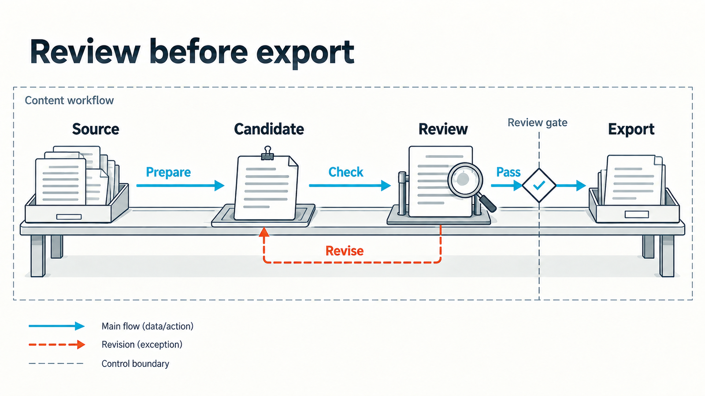

# Pinshu Business Graphics - public preview 0.1.4

Seven visual method families for business arguments: typographic metaphor, strategic map, structural section, editorial collage, engineering blueprint narrative, Chinese modernism and data journalism.

This independent companion selects by information relationship, distinguishes design metaphors from source facts, anchors content to original text and reuses the public core for platform dimensions and raster delivery. No personal character or private example image is included.

Tell your image-capable agent:

> Use pinshu-business-graphics to visualize this business source. Recommend a mother by its information relationship, preserve evidence boundaries, generate and inspect one image, then prepare the reviewed candidate.

See [method router](references/router.md), [quickstart](references/quickstart.md) and [actual-image review](references/visual-qa.md). Requires the public pinshu-visual-system 0.2.4 or later beside this package. Python 3 plans the graphic; an image-capable agent renders; ImageMagick 7 exports raster candidates. Exact charts require an editable chart tool and independent data review.

The seven cards describe methods, not seven bundled AI models or a claim of batch stability. Repository instructions are English; visible output follows the user's language. The repository's existing usage and redistribution terms apply.

## An actual example

This new AI-generated example follows the included original source and executable brief. The proposed workbench metaphor shows Source -> Candidate -> Review -> Export, with a separate Revise path returning to Candidate. The review gate controls export. The first rendering was rejected for four equal enclosing cards; one targeted edit rebuilt the composition as a coherent open schematic while retaining the source relationships.

The [exact generation record](examples/review-workbench.generation.json) and [evidence record](examples/review-workbench.evidence.json) preserve the prompt, source/image hashes, actual-image observations and 1600 x 900 export. Export and clean-copy checks passed locally. Human aesthetic acceptance and stable batch performance remain pending.
