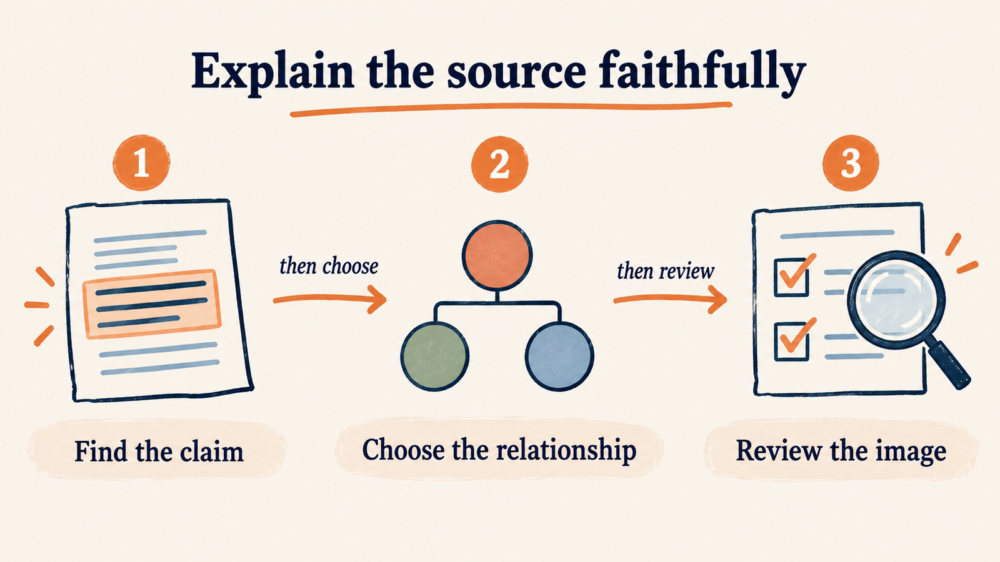

# Pinshu Infographic - public preview 0.1.3

Create readable source-faithful knowledge diagrams with one main relationship: processes, comparisons, hierarchy, components or genuine feedback loops. This independent companion adds diagram-specific source anchors, density and visual checks while reusing the public visual core.

Use with public pinshu-visual-system 0.2.3 or later installed beside this folder. baoyu-infographic is an optional separately installed workflow, not a hidden prerequisite or bundled dependency. Personal character images are excluded. Repository instructions are English; output follows the user's language.

Tell your image-capable agent:

> Use pinshu-infographic to explain this source as one readable diagram. Recommend the relationship and mode, inspect a first actual image, and prepare the platform-sized candidate. Use no fixed character.

See [quickstart](references/quickstart.md), [diagram review](references/visual-qa.md) and the included executable brief. Planning uses Python 3; generation needs an image-capable agent; export uses ImageMagick 7. This preview establishes an inspectable workflow, not stable batch aesthetics.

## An actual example

This new AI-generated example follows the included original source and executable brief: Find the claim, Choose the relationship, Review the image. The two labelled arrows preserve the supported reading order. Warm Paper uses no fixed character. The illustration contains no factual dataset.

The [exact generation record](examples/source-faithful-diagram.generation.json) and [evidence record](examples/source-faithful-diagram.evidence.json) preserve the prompt, source/image hashes, actual-image observations and 1600 x 900 export. Export and clean-copy checks passed locally. Human aesthetic acceptance and stable batch performance remain pending.
