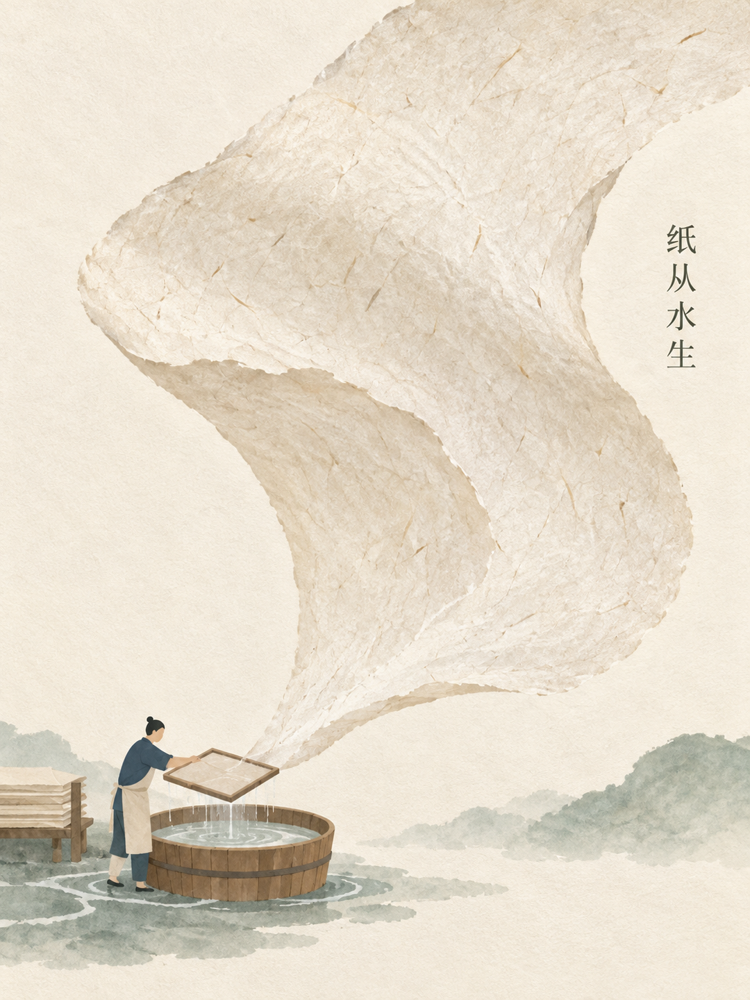

# Pinshu Visual System - public preview 0.2.4

A usable shared visual workflow developed by Aidan (Pinshu) with Codex: read the content, select a visual relationship and style, generate with your agent, inspect the actual image, and export a reviewed candidate for its platform.

## What colleagues receive

- Twelve visual-mode cards with explicit available, scoped, character-dependent and candidate states;
- A routing index to the seven complete business-visual families in the independent companion;
- Two experimental cultural-poster method cards, separate from the twelve visual modes;
- Seven information structures and eighteen composition/package IDs;
- Eleven project platform presets, including WeChat wide/square covers, article images, vertical cards, X and presentation images;
- A standard-library plan compiler, user-supplied character profiles and exact-text routing;
- Exact-size export, crop previews, metadata-clean copies and a fail-closed delivery wrapper;
- A source brief, command examples, actual public example and local regression tests.

No personal character artwork or private project material is included. Users can work without a character or bring their own approved identity references.

## Honest scope

This is a maintained public preview. It is usable with an image-capable agent, but it is not a standalone image generator or a claim of fully stable automatic batch production. Scripts verify declared contracts, hashes, dimensions and copy integrity. People and reviewing agents still inspect content, lettering and aesthetics. Candidate and frozen modes are clearly separated; the first public edition is independently versioned rather than inheriting a private maturity claim.

Planning needs Python 3; image export needs ImageMagick 7. Read [quickstart](references/quickstart.md). The repository's original usage and redistribution terms apply.

## An actual example

This AI-generated example used the included [brief](examples/brief.md) and Notebook Knowledge Explainer mode. The three scenes mean: compare with the source, check names and numbers, and inspect the thumbnail/reading order. The visible "123" is an illustrative placeholder, not a factual statistic. No private character or real person is depicted.

The saved [compiled prompt](examples/draft-review.compiled-prompt.txt) and [evidence record](examples/draft-review.evidence.json) document the generation channel, actual-image inspection and exact 1600 x 900 export. The image is a demonstration candidate; one result does not establish aesthetic acceptance or stable batch output.

## The complete visual set

Use [pinshu-infographic](../pinshu-infographic/README.md) for knowledge-diagram source anchors, relations and density. Use [pinshu-business-graphics](../pinshu-business-graphics/README.md) for the seven business mothers and commercial mechanism review. Both public companions require this public core 0.2.4 or later in a sibling folder. The repository installer adds the full set together and refuses to replace private installations of any of these names.

## Cultural-poster method experiments

These two new AI-generated examples test [Oriental Material Craft](references/method-cards/oriental-material-craft.md): the large form grows from the small workshop's material/action. Fibre sheet and folded geometry yield different compositions. Each is exported to 1080 x 1440 from a dedicated portrait generation. The short Chinese titles are intentionally localized image content. The English source concepts and exact prompts are retained in the respective source and generation records; JSON encodes localized title characters with standard Unicode escapes.

[Papermaking source](examples/craft-paper.source.md), [generation record](examples/craft-paper.generation.json), [evidence](examples/craft-paper.evidence.json). [Paper-folding source](examples/craft-fold.source.md), [generation record](examples/craft-fold.generation.json), [evidence](examples/craft-fold.evidence.json).

Actual-image review checked title accuracy, material/action connection, thumbnail and safe export. Both remain method candidates pending human aesthetic review and further themes. The original external research references still need source recovery; no original prompt or reference image is redistributed. [Colorfield Landscape](references/method-cards/oriental-colorfield-landscape.md) is also a candidate card, with no new rendering or promotion claimed in this release.
